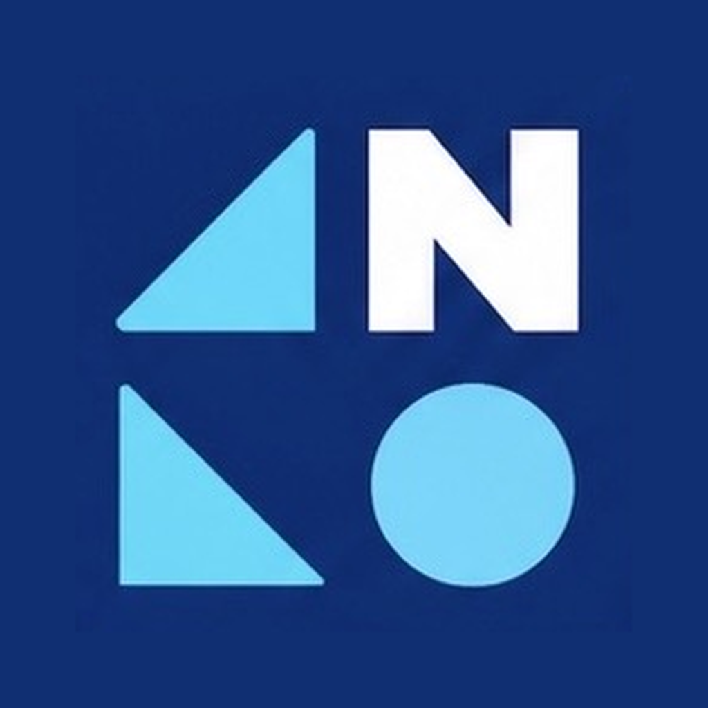
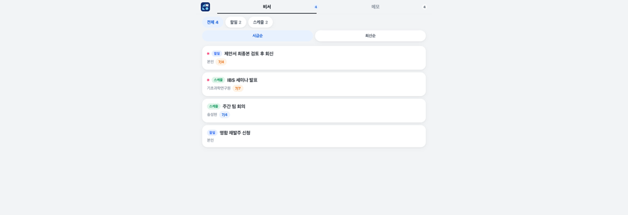

<div align="center">



# ANA Starter

### A ready‑to‑run Agent‑Native App you grow by talking.

[](https://github.com/tykimos/ana-starter/generate)
[](https://github.com/tykimos/ana-starter/stargazers)
[](LICENSE)
[](https://claude.com/claude-code)

**English** · [한국어](README.ko.md)

<br/>



</div>

A base [**ANA**](https://github.com/tykimos/agent-native-agent) app template — the **same look, logo, and runtime** as the reference dashboard, pre‑wired so you don't start from an empty screen. It boots with a simple menu you grow by talking:

```
비서 (Secretary)        메모 (Memo)
├─ 할일  (To-do)        ├─ 업무  (Work)
└─ 스케줄 (Schedule)     └─ 공부  (Study)
```

---

## What you get

- **Identical design system** — reuses `design-tokens.css`, the ANA logo, PWA icons, manifest, and service worker.
- **The ANA runtime bridge** — `server.js` (zero‑dependency Node) + `fakechat-bridge.js`: watch a dashboard, converse with a coding agent, approve changes, version‑synced across devices.
- **A clean starting board** — `data/state.json` seeded with a few items per category. Delete them and make it yours.

## Run

```bash
node server.js     # or: npm start   |   node start.js
# → http://localhost:8777   (override with PORT=)
```

No `npm install` needed — the server uses only Node built‑ins (web‑push is optional and stays disabled without `data/vapid.json`).

**GitHub Codespaces:** run `node server.js`, then open the auto‑forwarded **port 8777** (Ports tab → the 🌐 URL). The entry file is `server.js` — `node start.js` and `npm start` also work. It opens straight to the dashboard (no login).

> **Protecting a public URL:** the login gate is **off by default** (so dev/Codespaces just works). To require an access key on externally‑forwarded traffic, run with `ANA_REQUIRE_AUTH=1 node server.js` — the key is the `password` in `data/auth.json` (auto‑generated).

## Grow it by talking

This is an **agent‑native** app: the coding agent is the runtime. Open the chat (bottom‑right), and:

```
"할일에 '제안서 마감' 추가해줘"
"메모 > 공부에 오늘 읽은 논문 정리해줘"
"상단에 이번 주 완료 개수 배지 붙여줘"     # ← evolve the app itself, no deploy
```

Changes arrive as before/after proposals you approve; state bumps a `version` and every device syncs.

## Connect a coding agent (the full loop)

Running `node server.js` alone gives you the **dashboard + chat UI** — messages you type are queued, but nobody answers yet. The converse loop has four parts:

```
Dashboard → ② server.js(:8777) → ③ fakechat-bridge.js → ④ fakechat channel(:8787) → ⑤ Claude Code session
            └──────── in this repo ────────┘             └──── runtime environment (not bundled) ────┘
```

| Part | What | Where |
|---|---|---|
| ② `server.js` | dashboard + chat inbox/feed/approve API | ✅ this repo |
| ③ `fakechat-bridge.js` | relays the inbox to the fakechat channel | ✅ this repo (run it) |
| ④ **fakechat channel** (`:8787`) | pushes messages into a Claude session (MCP) | ⛭ Claude Code plugin/channel |
| ⑤ **Claude Code session** | reads the dashboard, acts, replies via `POST /api/agent` | ⛭ a running session |

**Start ② + ③ together:**

```bash
npm run all        # = bash run-all.sh  → server.js + fakechat-bridge.js
```

Then complete the loop by running a **Claude Code session that has the fakechat channel connected**, pointed at this dashboard. That session *is* the coding agent — it receives your messages and answers with rich, approvable proposals. Configure the relay with env vars if needed: `DASH_URL` (default `http://127.0.0.1:8777`), `FAKECHAT_WS` (default `ws://127.0.0.1:8787/ws`).

> **Codespaces note:** a Codespace runs the dashboard fine, but there is no Claude session or fakechat channel inside it by default — chat stays queued. Run the full loop locally (where Claude Code + the fakechat channel live), or bring those into the Codespace. The [ANA harness](https://github.com/tykimos/agent-native-agent) + [`fakechat-dashboard-agent`] building block set up ④/⑤.

### Nothing happens when I send a message

Parts ③④ fail **silently** — no error, no log. Don't guess; bisect. Skip the relay and inject straight into the channel:

```bash
curl -s -X POST localhost:8787/ -F 'id=diag-1' -F 'text=diagnostic'   # expect: 204
```

- **It shows up in your session** → the channel is fine; the culprit is the app or the relay. Most common: the WS payload is missing `id` (fakechat drops any message without a truthy `id`), or `fakechat-bridge.js` isn't running.
- **It doesn't show up** → your session isn't attached to the channel. **Channels only attach at startup** — restart with `claude --channels plugin:fakechat@claude-plugins-official` (list multiple channels inside *one* flag; passing the flag twice drops the earlier one).
- **Another session answers instead** → port collision. Give each session its own `FAKECHAT_PORT`, and point the relay's `FAKECHAT_WS` at the same port — changing only one side breaks it silently.

Full 4‑segment diagnosis, symptom table, and safe restart order: [connection-troubleshooting.md](https://github.com/tykimos/agent-native-agent/blob/main/skills/realtime-mirror-channel/references/connection-troubleshooting.md).

## Structure

```
ana-starter/
├── index.html          # the dashboard UI (비서·메모)  — edit the IA here
├── design-tokens.css   # design system (do not hardcode colors; use tokens)
├── server.js           # dashboard + chat bridge (Node built-ins only)
├── fakechat-bridge.js  # inbound relay to the coding-agent channel
├── logo.png · icon-*.png · manifest.json · service-worker.js   # PWA
└── data/state.json     # your items ({version, items:[...]})
```

Built with **[ANA — Agent‑Native Agent](https://github.com/tykimos/agent-native-agent)** · lifestyle cases in **[ANL](https://github.com/tykimos/agent-native-lifestyle)**.

> If this starter saved you from a blank screen, **⭐ star it** so others can find it.

## License

[AGPL-3.0](LICENSE) © [tykimos](https://github.com/tykimos) · AI Factory Inc.

Free to use, modify, and self-host. If you run a modified version as a network service, AGPL §13 requires you to publish your source. Building something closed-source or hosted? A **[commercial license](COMMERCIAL.md)** is available.
